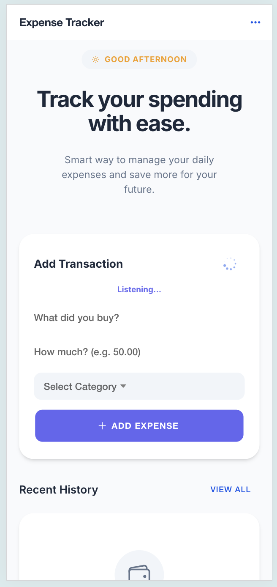
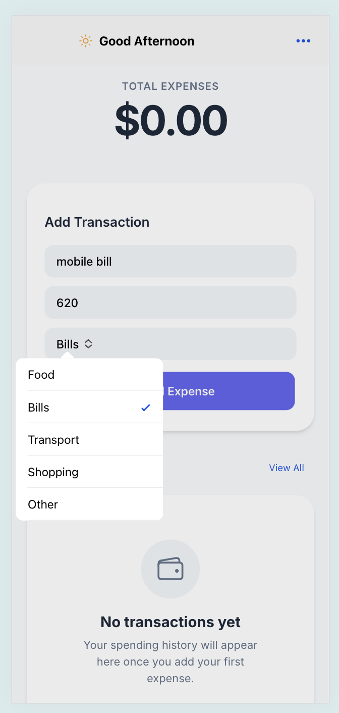
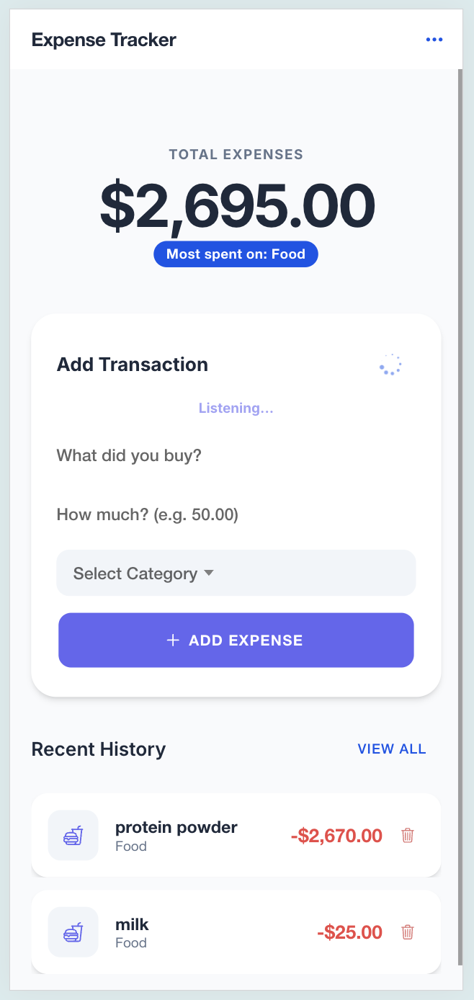
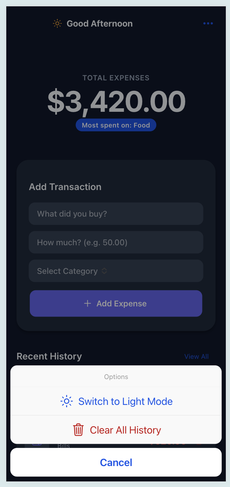

## Demo
<p align="center">
  
  
</p>

<p align="center">
  
  
</p>

# Expense Tracker

A simple, mobile-first expense tracking app built using React and Ionic.

This project focuses on building a clean and maintainable frontend with good UX practices, without adding unnecessary complexity.

---

## Features

- Add expense (title, amount, category)
- Delete expense with confirmation
- View total expenses
- Persistent data using localStorage
- Controlled categories (predefined options)
- Basic input validation and feedback

---

## Tech Stack

- React (Functional Components + Hooks)
- Ionic React
- TypeScript
- LocalStorage

---

## Key Decisions

- Kept state simple → used useState instead of external state libraries  
- No backend → used localStorage for persistence  
- Minimal component structure → separated only form and list  
- Controlled inputs → avoids inconsistent data  
- Focused scope → avoided adding unnecessary features  

---

## Project Structure

- Home.tsx → manages state and core logic  
- ExpenseForm.tsx → handles input and validation  
- ExpenseList.tsx → renders expenses and delete actions  

---

## Run Locally

```bash
npm install
npm run dev

#  # Expense Tracker

# A modern, clean, and professional expense tracking application built with **React** and **Ionic**. Designed as a high-quality portfolio piece, this app focuses on a premium user experience with real-time feedback, insightful spending summaries, and a sleek card-based UI.

# ## ✨ Features

# - **📊 Dynamic Dashboard**: Instantly view total spending and personalized insights.
# - **🕒 Thoughtful Greetings**: Personalized welcome messages based on the time of day.
# - **🏷️ Smart Categorization**: Organized transactions with intuitive category selection and automated icons.
# - **💡 Spending Insights**: Automatically identifies your highest spending category to help you manage finances better.
# - **✅ Robust Validation**: Built-in input validation with native-style alerts (`IonAlert`) and success toasts (`IonToast`).
# - **🗑️ Safeguarded Actions**: Delete confirmation dialogs to prevent accidental data loss.
# - **📱 Responsive & Premium UI**: Built with a custom design system focusing on typography (Inter), soft shadows, and clean layouts.
# - **💾 Persistent Data**: Uses LocalStorage to keep your data safe between sessions.

# ## 🛠️ Tech Stack

# - **Frontend**: React (Functional Components + Hooks)
# - **UI Framework**: @ionic/react (V5+)
# - **Icons**: Ionicons
# - **Styling**: Vanilla CSS with a custom Design System
# - **State Management**: React useState + useMemo
# - **Persistence**: LocalStorage API

# ## 🚀 Getting Started

# ### Prerequisites

# - Node.js (Latest LTS recommended)
# - npm or yarn

# ### Installation

# 1. Clone the repository:
#    ```bash
#    git clone https://github.com/sukumar-chennari/expenseTracker.git
#    ```

# 2. Install dependencies:
#    ```bash
#    npm install
#    ```

# 3. Start the development server:
#    ```bash
#    npm run dev
#    ```

# ## 📖 Key Components

# - **Home.tsx**: The central hub, managing state and dashboard insights.
# - **ExpenseForm.tsx**: A powerful entry component with validation and focus management.
# - **ExpenseList.tsx**: A stylized history tracking component with category-specific visuals and deletion logic.

# ## 🎨 Design Principles

# This project adheres to modern web design standards:
# - **HSL-tailored colors** for harmonious palettes.
# - **Glassmorphism** and soft-depth effects.
# - **Micro-animations** (Fade-ins) for a responsive feel.

# ---
# Built by [Sukumar Chennari](https://github.com/sukumar-chennari) 
